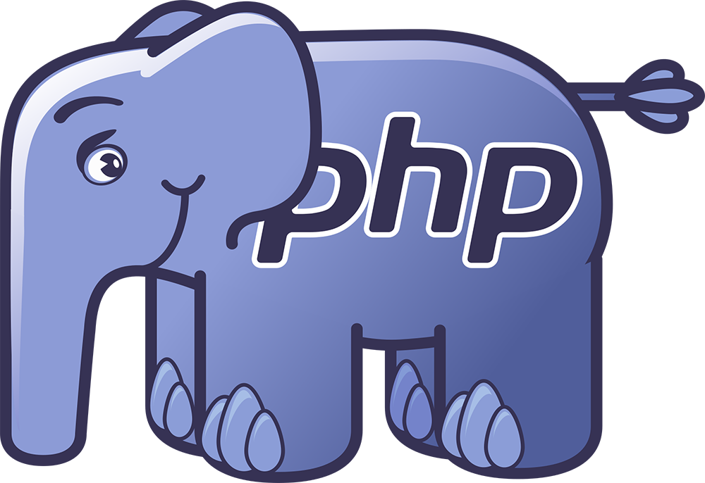
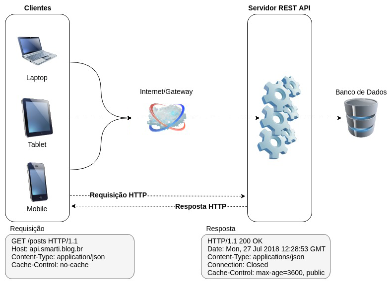
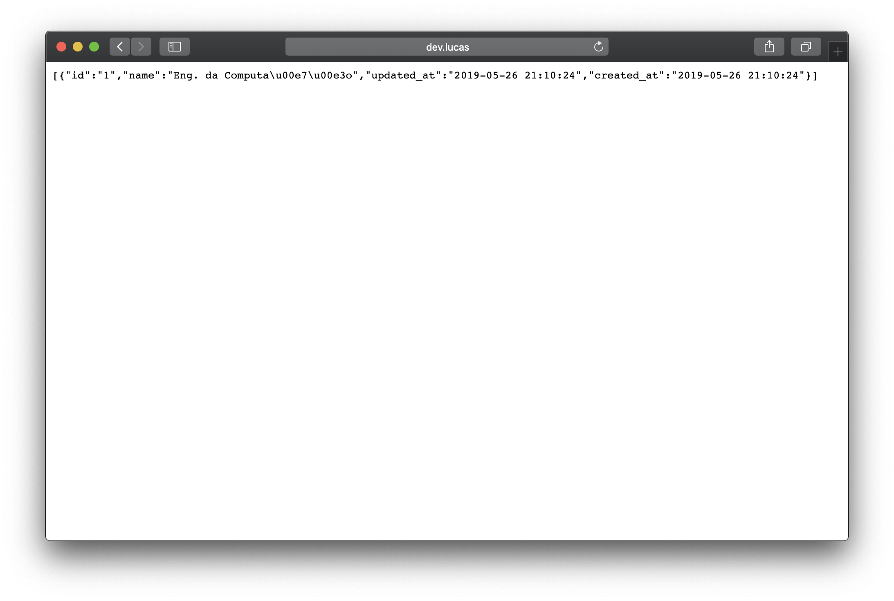

name: capa

.capa-titulo[

# Soluções WEB

]

.capa-subtitulo[

### Prof. Lucas Ferreira

]

---

class: center, middle
count: false

# Webservices _(REST)_ com PHP<br />_(em Laravel)_

.center[.php-img[]]

---

## O que é REST?

**Representational State Transfer (REST)**, ou Transferência de Estado Representacional

Estilo de arquitetura que define um conjunto de restrições e propriedades baseados em HTTP(S)

RESTful é uma implementação de um web service simples utilizando o HTTP e os princípios REST

Sendo assim, Web Services que obedecem ao estilo arquitetural REST, ou web services RESTful

Objetiva principalmente a interoperabilidade entre sistemas de computadores na Internet

Requisições feitas a um URI de recurso extrairá uma resposta que pode estar em **JSON**, XML, HTML ou algum outro formato

Quando o HTTP é usado, como é mais comum, as operações disponíveis são _GET, POST, PUT, DELETE_

---

## Premissas Básicas do REST

--

### Client-Server

O cliente _(consumidor do serviço)_ não se preocupa com tarefas do tipo: comunicação com banco de dados, gerenciamento de cache, log e etc

E o servidor _(provedor do serviço)_ não se preocupa com tarefas como: interface, experiência do usuário e etc

--

### Stateless

Um mesmo cliente pode mandar várias requisições para o servidor, porém, cada uma delas devem ser independentes, ou seja, toda requisição deve conter todas as informações necessárias para que o servidor consiga entendê-la e processá-la adequadamente

O servidor não deve guardar nenhuma informação a respeito do estado do cliente

--

### Uniform Interface

É, basicamente, um contrato para comunicação entre clientes e servidor. São pequenas regras para deixar um componente o mais genérico possível, o tornando muito mais fácil de ser refatorado e melhorado

---

## Como funciona?

.center[.diagram-img[]]

---

class: center, middle
count: false

# A IDÉIA 💡

---

## Demonstrando o REST

Dando continuidade na aula passada _(sobre PHP moderno e frameworks)_ iremos estender o uso do framework Laravel até a criação de uma pequena API REST

--

Esta API irá interagir com banco de dados e cobrir as ações de **GET, POST, PUT e DELETE**

O formato final de _output_ da API será **JSON**

--

Teremos dois _CRUDs_: **Cursos** e **Alunos**

---

## Demonstrando REST

Quando uma requisição do tipo `GET` for efetuada para o _resource_ de **cursos** iremos listar uma lista de cursos composta por: **id** e **nome** de cada curso.

Quando uma requisição do tipo `POST` for efetuada para o _resource_ de **cursos** iremos adicionar um novo curso.

Quando uma requisição do tipo `PUT/PATCH` for efetuada para o _resource_ de **cursos** acompanhada de um registro prévio, iremos alterar o nome de um curso já existente.

Quando uma requisição do tipo `DELETE` for efetuada para o _resource_ de **cursos** acompanhada de um ID, iremos deletar o curso em questão.

---

## Demonstrando REST

Quando uma requisição do tipo `GET` for efetuada para o _resource_ de **alunos** iremos listar uma lista de cursos composta por: **id**, **nome**, **codigo**, **email** e **Curso** de cada aluno.

Quando uma requisição do tipo `POST` for efetuada para o _resource_ de **alunos** iremos adicionar um novo aluno.

Quando uma requisição do tipo `PUT/PATCH` for efetuada para o _resource_ de **alunos** acompanhada de um registro prévio, iremos alterar o registro de um aluno já existente.

Quando uma requisição do tipo `DELETE` for efetuada para o _resource_ de **alunos** acompanhada de um ID, iremos deletar o aluno em questão.

---

## Recap: _Iniciando um projeto com Laravel_

Utilizando o `composer`, vamos iniciar um novo projeto com o Laravel _(versão 5.8.x)_:

```bash
composer create-project laravel/laravel projeto-api "5.8.*"
```

--

Após este comando, teremos uma nova pasta chamada `projeto-api` aonde nosso projeto irá evoluir.

Maiores informações sobre instalação de um projeto acessem o link: <https://laravel.com/docs/5.8#installation>

--

Para finalizar esta etapa, como iremos trabalhar com **Apache HTTP** nosso projeto roda com "ponto de acesso" na pasta `public`, ou seja:

<http://localhost/projeto-api/public>

---

### Recap: _Configurando a conexão com o banco de dados_

O primeiro passo será configurar nossa conexão com o banco de dados.

Isso pode ser feito em `config/database.php`:

```php
'mysql' => [
  'driver'    => 'mysql',
  'host'      => 'localhost',
  'database'  => 'satc',
  'username'  => 'root',
  'password'  => '123456',
  'charset'   => 'utf8',
  'collation' => 'utf8_unicode_ci',
],
```

Ou em nosso arquivo `.env` do projeto:

```code
DB_CONNECTION=mysql
DB_HOST=localhost
DB_DATABASE=satc
DB_USERNAME=root
DB_PASSWORD=123456
```

---

## _Resource_ de Cursos

Começaremos nossa API pelo resource de **Cursos**, iniciaremos com uma tabela simples no banco de dados:

```sql
CREATE TABLE `cursos` (
  `id` int(11) NOT NULL,
  `name` varchar(255) NOT NULL,
  `updated_at` datetime NOT NULL,
  `created_at` datetime NOT NULL
) ENGINE=InnoDB DEFAULT CHARSET=utf8;

ALTER TABLE `cursos` ADD PRIMARY KEY (`id`);
```

--

Logo após isso podemos criar nosso **Model** _(lembra do padrão MVC?)_ utilizando o utilitário `artisan` do Laravel:

```bash
php artisan make:model Curso
```

--

Com isto estaremos criando o arquivo `app/Curso.php`. Não se esqueça de adicionar a variável `$table` com o nome da tabela "cursos" dentro do código-fonte do Model.

---

## _Resource_ de Cursos

Nossa ideia é disponibilizar os acessos da seguinte forma

- **GET** `http://localhost/projeto-api/public/api/cursos`<br />listagem de cursos cadastrados

- **GET** `http://localhost/projeto-api/public/api/cursos/{id}`<br />apenas um curso em específico

- **POST** `http://localhost/projeto-api/public/api/cursos`<br />envio de um payload para cadastro

- **PUT** `http://localhost/projeto-api/public/api/cursos/{id}`<br />envio de um payload para alteração

- **DELETE** `http://localhost/projeto-api/public/api/cursos/{id}`<br />excluir um curso

---

## _Resource_ de Cursos

Nosso próximo passo será criar o **Controller** de cursos, usando o utilitário `artisan` do Laravel:

```bash
php artisan make:controller CursosController
```

ou em Laravel mais atualizado / moderno:

```bash
php artisan make:controller CursosController --resource --model=Curso
```

--

Um novo arquivo será criado em `app/Http/Controllers/CursosController.php`, aproveitando já iremos _"importar"_ o Model de Curso:

```php
<?php
namespace App\Http\Controllers;

use Illuminate\Http\Request;

use App\Curso; <-- estamos importando o Model "Curso" aqui
use App\Http\Requests;
use App\Http\Controllers\Controller;

class CursosController extends Controller
{
  ...
```

---

### Controllers do Laravel e suas actions/resources

Se analisarmos o código do nosso recém criado `app/Http/Controllers/CursosController.php` veremos o seguinte:

```code
// Exibe a lista de registros cadastrados
public function index()

// Exibe o formulário para criação de novos registros (?)
public function create()

// Salva novos registros após um envio POST
public function store(Request $request)

// Exibi apenas um registro específico
public function show($id)

// Exibi o formulário para edição de um registro (?)
public function edit($id)

// Atualiza no banco um registro após um envio PUT/PATCH
public function update(Request $request, $id)

// Exclui um registro específico (pelo ID informado)
public function destroy($id)
```

---

### Controllers do Laravel e suas actions/resources

Retornando a aula passada, não podemos esquecer que para cada controller, devemos preparar suas rotas de acesso. No arquivo `routes/api.php` normalmente teríamos isto:

```php
<?php
// O método estático `Route::group` serve para "agrupar"
// um cojunto de rotas sobre uma "árvore" em comum,
// ex: /api/cursos
Route::group(array('prefix' => 'api'), function () {
  Route::get('/cursos', 'CursosController@index');
  Route::get('/cursos/create', 'CursosController@create');
  Route::post('/cursos', 'CursosController@store');
  Route::get('/cursos/{id}', 'CursosController@show');
  Route::get('/cursos/{id}/edit', 'CursosController@edit');
  Route::put('/cursos/{id}', 'CursosController@update');
  Route::delete('/cursos/{id}', 'CursosController@destroy');
});
```

São todas as rotas/url mínimas para efetuar um CRUD com a sugestão de estrutura do Laravel.

---

### Controllers do Laravel suas actions/resources

Para finalizar o assunto "rotas" o Laravel disponibiliza mais um _"recurso inteligente"_ para quem segue as convenções esperadas de um controller _RESTful_, podemos trocar todas as linhas de rotas especificadas no slide anterior por apenas esta:

```php
Route::resource('cursos', 'CursosController');
```

--

Usando a linha acima o Laravel irá montar para nós o seguinte esquema de rotas:

| Método    | Caminho/URL              | Ação    | Rota           |
| --------- | ------------------------ | ------- | -------------- |
| GET       | /api/cursos              | index   | cursos.index   |
| GET       | /api/cursos/create       | create  | cursos.create  |
| POST      | /api/cursos              | store   | cursos.store   |
| GET       | /api/cursos/{curso}      | show    | cursos.show    |
| GET       | /api/cursos/{curso}/edit | edit    | cursos.edit    |
| PUT/PATCH | /api/cursos/{curso}      | update  | cursos.update  |
| DELETE    | /api/cursos/{curso}      | destroy | cursos.destroy |

---

### Controllers do Laravel suas actions/resources

Como nosso objetivo é construir uma API para comunicação entre "sistemas independentes" com o formato de _output_ em JSON, não faz sentido que tenhamos _actions_ com recursos visuais como formulários para cadastro, isso é responsabilidade de quem _(ou o que)_ irá usar nossa API.

--

Logo podemos **descartar** as actions/métodos `create` e `edit` junto de suas rotas de todos os nossos controllers envolvidos com a API REST.

--

Por fim, para não termos problemas relacionados ao Token de segurança que o Laravel exige em formulários, iremos desabilitar a checagem adicional para toda nossa API.

No arquivo `app/Http/Middleware/VerifyCsrfToken.php` iremos adicionar uma _exception_ para liberar todas as URLs que iniciam com _"api/"_:

```php
protected $except = [
    "api/*"
];
```

---

### Listando os Cursos cadastrados

Como estamos criando uma API Rest que irá "emitir" retornos em JSON, não precisamos trabalhar com "afinco" em nossa camada **View**.

--

Nosso primeiro passo será voltar ao controller e editar a _action_ **index** para listarmos nossos registros do banco:

```php
// app/Http/Controllers/CursosController.php

public function index()
{
  $cursos = Curso::orderBy('name', 'ASC')->get();
```

--

Por fim precisamos retornar algo como _output_ de nossa função. Normalmente retornaríamos uma _view_ criada com uma template Blade por exemplo: `view('home/index')`

--

Mas no caso de JSON o Laravel facilita nossa vida e não precisamos nem criar um arquivo/template de view. Precisaremos apenas emitir uma "resposta" usando o método `json`:

```php
  return response()->json($cursos);
}
```

---

### Listando os Cursos cadastrados

Se tudo deu certo, com pelo menos um registro na tabela **cursos**, teremos o seguinte resultado quando acessarmos a URL abaixo:

<http://localhost/projeto-api/public/api/cursos>

.center[.print-img[]]

---

### Cadastrando um novo Curso

Dando continuidade a API, iremos agora criar a _resource_ responsável por receber uma requisição do tipo POST e cadastrar um novo curso no banco de dados.

Em nosso controller iremos agora editar a função **store**:

```php
// app/Http/Controllers/CursosController.php

public function store(Request $request)
{
  $curso = new Curso();
  $curso->name = $request->input('name');
  $curso->save();

  return response()->json($curso);
}
```

--

1. Iniciamos criando um novo Modelo/Entidade baseada no **Model** Curso.

2. Logo após obteremos o valor `name` do payload JSON que será enviado junto da requisição POST.

3. Iremos através do método `save` inserir oficialmente o novo registro no banco.

4. Por fim iremos retornar como _response_ o novo registro criado junto do ID<br />que ele acabou de ganhar.

---

### Cadastrando um novo Curso

Neste momento podemos testar o cadastro de um novo curso com a seguinte requisição:

```
POST /projeto-api/public/api/cursos HTTP/1.1
Host: localhost
Content-type: application/json

{ "name": "Artes Visuais" }
```

--

Logo teremos o retorno do curso junto do ID que ele acaba de ganhar no banco de dados, indicando **sucesso**:

```json
{ "id": 2, "name": "Artes Visuais" }
```

---

### Obtendo um registro específico

Este será o método mais fácil, no controller **CursosController** edite o método **show**:

```php
// app/Http/Controllers/CursosController.php

public function show($id)
{
  $curso = Curso::find($id);
  return response()->json($curso);
}
```

--

1. Primeiro obtemos o registro do banco utilizando o método estático `find` pelo ID informado na URL

2. Depois enviamos para o _output_ no formato JSON

---

### Atualizando um Curso já cadastrado

Para criarmos a _resource_ responsável por receber uma requisição PUT contendo os dados a serem atualizados de um curso iremos em nosso controller editar a função **update**:

```php
// app/Http/Controllers/CursosController.php

public function update(Request $request, $id)
{
  $curso = Curso::find($id);
  $curso->name = $request->input('name');
  $curso->save();

  return response()->json($curso);
}
```

--

1. Primeiro obtemos o registro do banco utilizando o método estático `find` pelo ID informado na URL

2. Logo após obteremos o valor `name` do payload JSON que será enviado junto da requisição PUT.

3. Iremos através do método `save` alterar oficialmente o registro no banco.

4. Por fim iremos retornar como _response_ o registro atualizado.

---

### Deletando um curso

No controller **CursosController** edite o método **destroy**:

```php
// app/Http/Controllers/CursosController.php

public function destroy($id)
{
  $curso = Curso::destroy($id);
  return response()->json(array("id" => $id));
}
```

--

1. Primeiro deletaremos o registro do banco utilizando o método estático `destroy` pelo ID informado na URL

2. Depois enviamos para o _output_ no formato JSON

---

class: center, middle
count: false

# E os Alunos?

---

## _Resource_ de Alunos

Agora que já concluímos a _resource_ de Cursos, podemos iniciar a de Alunos.

Primeiro iremos criar a tabela de **alunos** em nosso banco:

```sql
CREATE TABLE `alunos` (
  `id` int(11) NOT NULL,
  `curso_id` int(11) NOT NULL,
  `codigo` varchar(64) NOT NULL,
  `nome` varchar(255) NOT NULL,
  `email` varchar(255) DEFAULT NULL,
  `updated_at` datetime NOT NULL,
  `created_at` datetime NOT NULL
) ENGINE=InnoDB DEFAULT CHARSET=utf8;

ALTER TABLE `alunos` ADD PRIMARY KEY (`id`);
```

--

Perceba que além do que já vimos no CRUD de Cursos, nossa tabela **alunos** possui um campo de ligação entre a tabela `alunos` e a tabela `cursos` que é o campo **curso_id**.

--

Logo após isso podemos criar nosso **Model** utilizando o utilitário `artisan` do Laravel:

```bash
php artisan make:model Aluno
```

---

## _Resource_ de Alunos

Continuando o foco na diferença, o Laravel disponibiliza um jeito fácil de fazermos a ligação do Model Aluno com o Model Curso.

Podemos editar o arquivo `app/Aluno.php` e deixá-lo assim:

```php
class Aluno extends Model
{
  protected $table = "alunos";

  public function curso()
  {
    return $this->belongsTo("App\Curso", "curso_id");
  }
}
```

---

## _Resource_ de Alunos

Criando um método chamado `curso()` dentro de nosso Model Aluno, poderemos chamar o recurso de ligação um para um chamado `belongsTo`. Isso irá garantir que sempre que buscarmos um Aluno do banco o mesmo virá com seu curso relacionado.

--

Também será necessário que sempre que façamos uma _query_ para listar ou trazer um registro do banco de dados e seja de interesse da API exibir o nome do curso do Aluno, que incluamos o método `with` na montagem de _query_: `Aluno::with('curso')->get()`.

--

Vale a pena dar uma olhada na documentação do Laravel sobre todos os tipos de ligação entre tabelas: <https://laravel.com/docs/5.8/eloquent-relationships>

---

## _Resource_ de Alunos

Daqui em diante podemos seguir exatamente os mesmos passos do CRUD estabelecido em **Cursos**. Criarmos um controller para Alunos, estabelecer as rotas, definir os métodos/actions em nosso controller e testar todas as novas resources.

<br />

.center[<span style="font-size: 72px;">👊</span>]
